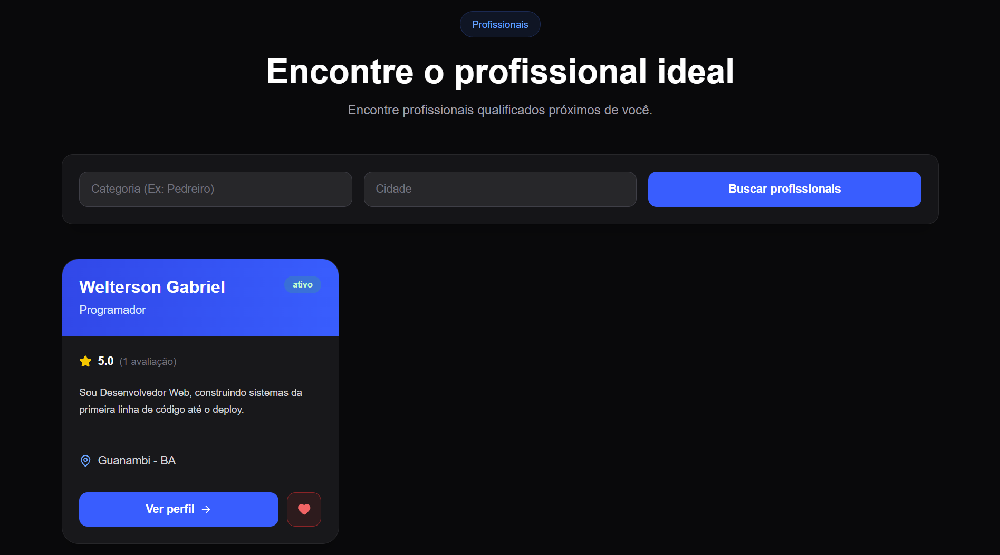
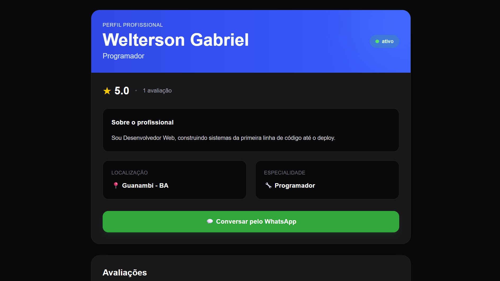
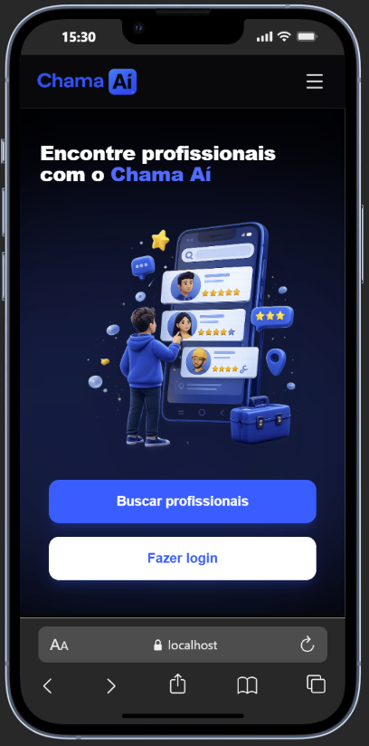

# 🚀 Chama Aí

<p align="center">
  
</p>

<p align="center">
  <strong>Encontre profissionais. Chame quem você precisa.</strong>
</p>

<p align="center">
  Um Micro-SaaS desenvolvido para conectar pessoas que precisam de serviços a profissionais disponíveis em sua região.
</p>

<p align="center">
  
  
  
  
</p>

---

## 📸 Sobre o projeto

**Chama Aí** é um Micro-SaaS desenvolvido com o objetivo de facilitar a busca por profissionais para diferentes tipos de serviços.

A ideia é simples:

> **Precisou de um profissional? Chama Aí.**

O usuário pode pesquisar profissionais por categoria e localização, visualizar seus dados e entrar em contato diretamente através do WhatsApp.

O projeto foi desenvolvido como uma aplicação **Full Stack**, utilizando **Python + FastAPI** no backend, **TypeScript + React** no frontend e **MySQL** como banco de dados.

---

## 🎯 Problema

Encontrar profissionais confiáveis para realizar pequenos serviços pode ser uma tarefa difícil.

Muitas vezes, as pessoas dependem de:

* Indicações de amigos;
* Grupos de WhatsApp;
* Redes sociais;
* Pesquisas espalhadas pela internet;
* Contatos antigos.

O **Chama Aí** busca centralizar essa experiência em uma única plataforma.

---

## 💡 Solução

A plataforma permite que usuários encontrem profissionais de diferentes categorias e regiões.

### 👤 Para quem precisa de um serviço

O usuário pode:

* 🔎 Pesquisar profissionais;
* 📂 Filtrar por categoria;
* 📍 Pesquisar por localização;
* 👨‍🔧 Visualizar profissionais disponíveis;
* 📱 Entrar em contato pelo WhatsApp.

### 🧑‍🔧 Para profissionais

O profissional pode:

* 📝 Criar seu cadastro;
* 🏷️ Selecionar sua categoria;
* 📍 Informar sua localização;
* 📄 Adicionar uma descrição sobre seus serviços;
* 🟢 Definir seu status de disponibilidade;
* 📱 Disponibilizar seu WhatsApp para contato.

---

# ✨ Funcionalidades

## 🔐 Autenticação

* Cadastro de usuários;
* Login;
* Autenticação utilizando JWT;
* Senhas armazenadas com hash;
* Proteção de rotas privadas.

## 🔎 Busca de profissionais

* Pesquisa de profissionais;
* Filtro por categoria;
* Filtro por cidade;
* Filtro por estado;
* Paginação;
* Exibição de profissionais ativos.

## 🧑‍🔧 Gerenciamento de profissionais

* Cadastro de perfil profissional;
* Atualização de informações;
* Atualização do status;
* Associação com categorias;
* Informações de contato.

## 📱 Contato

Após encontrar um profissional, o usuário pode utilizar o número cadastrado para entrar em contato diretamente pelo **WhatsApp**.

---


# 🛠️ Tecnologias utilizadas

## 🔙 Backend

| Tecnologia              | Utilização                        |
| ----------------------- | --------------------------------- |
| 🐍 **Python**           | Linguagem principal               |
| ⚡ **FastAPI**           | Construção da API REST            |
| 🗃️ **SQLAlchemy**      | ORM para comunicação com o banco  |
| 🔐 **JWT**              | Autenticação e autorização        |
| 🔒 **Passlib / bcrypt** | Hash de senhas                    |
| 📦 **Pydantic**         | Validação e serialização de dados |
| 📄 **Uvicorn**          | Servidor ASGI                     |

### Stack do Backend

<p>
  
</p>

---

# 🎨 Frontend

O frontend foi desenvolvido utilizando uma abordagem moderna baseada em componentes.

| Tecnologia           | Utilização                          |
| -------------------- | ----------------------------------- |
| ⚛️ **React**         | Construção da interface             |
| 🔷 **TypeScript**    | Tipagem estática                    |
| 🎨 **Tailwind CSS**  | Estilização                         |
| 🧭 **React Router**  | Gerenciamento das rotas             |
| 🔗 **Axios / Fetch** | Comunicação com a API               |
| ⚡ **Vite**           | Ambiente de desenvolvimento e build |

### Stack do Frontend

<p>
  
</p>

---

# 🗄️ Banco de dados

O projeto utiliza **MySQL** para armazenamento dos dados da aplicação.

Durante o desenvolvimento local, o banco foi executado através do **XAMPP**.

### Tecnologias

<p>
  
</p>

### Principais dados armazenados

* 👤 Usuários;
* 🧑‍🔧 Profissionais;
* 🏷️ Categorias;
* 🔗 Relacionamentos entre usuários, profissionais e categorias.

A aplicação utiliza o **SQLAlchemy** para realizar a comunicação entre o backend e o banco de dados.

---

# 🔐 Segurança

A segurança foi uma das partes importantes durante o desenvolvimento do projeto.

Entre as medidas implementadas estão:

* 🔑 Autenticação baseada em JWT;
* 🔒 Senhas armazenadas utilizando hash;
* 🛡️ Proteção de endpoints privados;
* ✅ Validação de dados através do Pydantic;
* 🔗 Controle de acesso através de autenticação;
* 🌐 Configuração de CORS;
* 🔐 Variáveis sensíveis separadas através de `.env`;
* 🚫 Não armazenamento de senhas em texto puro.

> Algumas melhorias de segurança, como Rate Limiting, podem ser adicionadas em versões futuras.

---

# 📱 Responsividade

A interface foi desenvolvida pensando em diferentes tamanhos de tela.

O layout se adapta para:

* 🖥️ Desktop;
* 💻 Notebook;
* 📱 Smartphones;
* 📲 Tablets.

A experiência mobile recebeu atenção especial para manter a interface simples e objetiva.

---

# 📸 Screenshots

## 🏠 Página inicial

<p align="center">
  
</p>

---

## 🔎 Busca de profissionais

<p align="center">
  
</p>

---

## 🧑‍🔧 Perfil profissional

<p align="center">
  
</p>

---

## 📱 Versão mobile

<p align="center">
  
</p>


---

# ⚙️ Como executar o projeto

## 📋 Pré-requisitos

Antes de executar o projeto, certifique-se de possuir:

* Python 3.10+
* Node.js
* npm
* MySQL
* XAMPP
* Git

---

# 🗄️ 1. Configurando o banco

Inicie o **XAMPP** e execute o serviço:

```text
MySQL
```

Crie o banco de dados utilizado pela aplicação.

Depois, configure as variáveis de ambiente do backend no arquivo:

```text
.env
```

Exemplo:

```env
DATABASE_URL=...
SECRET_KEY=...
```

> Nunca envie o arquivo `.env` para o GitHub.

---

# 🔙 2. Executando o Backend

Entre na pasta:

```bash
cd backend
```

Crie um ambiente virtual:

```bash
python -m venv venv
```

Ative o ambiente virtual.

### Windows

```bash
venv\Scripts\activate
```

Instale as dependências:

```bash
pip install -r requirements.txt
```

Execute a API:

```bash
uvicorn app.main:app --reload
```

O backend estará disponível em:

```text
http://127.0.0.1:8000
```

A documentação automática da API pode ser acessada através do Swagger:

```text
http://127.0.0.1:8000/docs
```

---

# 🎨 3. Executando o Frontend

Em outro terminal:

```bash
cd frontend
```

Instale as dependências:

```bash
npm install
```

Execute o projeto:

```bash
npm run dev
```

O Vite disponibilizará a aplicação em um endereço semelhante a:

```text
http://localhost:5173
```

---

# 🧠 O que aprendemos desenvolvendo o Chama Aí

O desenvolvimento do projeto proporcionou experiência prática em diversas áreas do desenvolvimento de software.

### Backend

* Desenvolvimento de APIs REST;
* FastAPI;
* Autenticação JWT;
* Hash de senhas;
* SQLAlchemy;
* MySQL;
* Validação de dados;
* Organização de rotas;
* Arquitetura de aplicações;
* Variáveis de ambiente;
* CORS.

### Frontend

* React;
* TypeScript;
* Componentização;
* React Router;
* Context API;
* Tailwind CSS;
* Responsividade;
* Consumo de APIs;
* Gerenciamento de estados;
* Integração com backend.

### Engenharia de software

* Git e GitHub;
* Organização de projetos;
* Separação entre frontend e backend;
* Modelagem de banco de dados;
* Desenvolvimento de MVP;
* Debugging;
* Segurança;
* Deploy e preparação para produção.

---

# 🚀 Próximos passos

O Chama Aí foi desenvolvido inicialmente como um **MVP**, mantendo o foco na funcionalidade principal da plataforma.

Algumas funcionalidades que podem ser adicionadas futuramente:

* 🔔 Notificações;
* 💬 Chat entre usuários e profissionais;
* 🛡️ Rate Limiting;
* ☁️ Melhorias na infraestrutura;
* 📱 Aplicativo mobile;
* 💳 Sistema de pagamentos.

---

# 🌎 Objetivo

O objetivo do Chama Aí é tornar a contratação de serviços **mais simples, rápida e acessível**.

Em vez de perguntar:

> "Você conhece alguém que faça esse serviço?"

A ideia é simplesmente:

> **"Chama Aí." 🚀**

---

# 👨🏻‍💻 Desenvolvedor

Desenvolvido por **Welterson Gabriel**.

Estudante de Ciência da Computação e desenvolvedor com foco em **Backend, Python, APIs e desenvolvimento Full Stack**.

<p align="center">

<a href="https://github.com/weltersongabriel">
  
</a>

<a href="https://www.linkedin.com/in/welterson-gabriel-131473313/">
  
</a>

</p>

---

# 🤖 Apoio no desenvolvimento com Inteligência Artificial

O desenvolvimento do Chama Aí também contou com o apoio da Inteligência Artificial, utilizada como uma ferramenta de aprendizado, desenvolvimento e resolução de problemas ao longo de todo o projeto.

Durante essa jornada, o ChatGPT, desenvolvido pela OpenAI, foi um importante parceiro técnico, auxiliando em diversas etapas do desenvolvimento, desde a concepção de ideias e arquitetura até a implementação, debugging e documentação do projeto.

---

<p align="center">

# 🚀 Chama Aí

**Encontre. Conecte. Chame.**

⭐ Se você gostou do projeto, considere deixar uma estrela no repositório!

</p>
